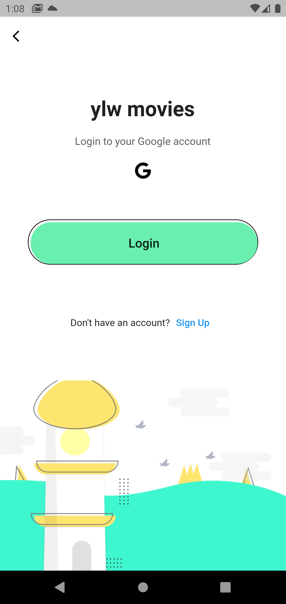

# ylw movies

A movie Wishlist with native nosql db.

## Getting Started

This project is a simple demonstration of CRUD application performed with Hive nosql DB
it store movie related Data in persistance local storage with the help of hive flutter.

The google Oauth used to validate user before making any operations on data.

# ylw-Movies

## Check the video for More information [Video](https://drive.google.com/file/d/10U9ptQ04wWxVsrR0FGk8bfCEAi-4w5oi/view?usp=sharing)

## Apk can be found [Apk](https://drive.google.com/file/d/1Hz7fJeKET2abYwczykhGrYwEEE3m-zqm/view?usp=sharing)

## notes

- The name of the apk is and_cut
- You need an active google account to signIn/ signUp
- Hive DB is used to store the information locally
- The images can be picked up from Gallery
- for performing CRUD on movies click on movie tile as explained in video
